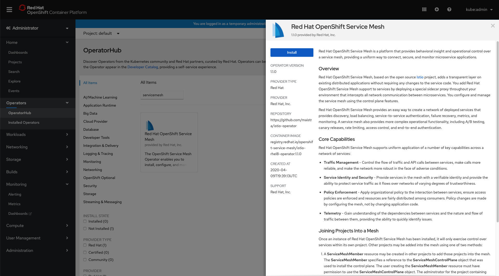

## Prerequisite
### View the specific of Operator available to the cluster from OperatorHub
```bash
./1-view-operator.sh
```

- Expected Output
```bash
NAME                     CATALOG             AGE
servicemeshoperator      Red Hat Operators   11h
kiali-ossm               Red Hat Operators   11h
jaeger-product           Red Hat Operators   11h
elasticsearch-operator   Red Hat Operators   11h
```



### Inspect the Operators
```bash
oc describe packagemanifests servicemeshoperator -n openshift-marketplace
```

## Install Red Hat Service Mesh Operator

```bash
./2-subscribe-service-mesh.sh
```

### Validate the subscription is successed
```bash
oc get sub -n openshift-operators
```

- Expected Output
```bash
NAME                     PACKAGE                  SOURCE             CHANNEL
elasticsearch-operator   elasticsearch-operator   redhat-operators   4.3
jaeger-product           jaeger-product           redhat-operators   stable
kiali-ossm               kiali-ossm               redhat-operators   stable
servicemeshoperator      servicemeshoperator      redhat-operators   stable
```

- Excepted Web view


