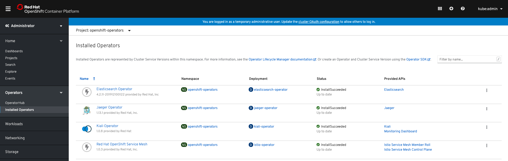

## Prerequisite
### View the specific of Operators `servicemeshoperator` available to the cluster from OperatorHub
```bash
oc get packagemanifests {servicemeshoperator,kiali-ossm,jaeger-product,elasticsearch-operator} -n openshift-marketplace
```

- Expected Output
```bash
NAME                     CATALOG             AGE
servicemeshoperator      Red Hat Operators   11h
kiali-ossm               Red Hat Operators   11h
jaeger-product           Red Hat Operators   11h
elasticsearch-operator   Red Hat Operators   11h
```

### Inspect the Operators
```bash
oc describe packagemanifests servicemeshoperator -n openshift-marketplace
```

## Install `Red Hat Service Mesh Operator`

### Subscribe `service-mesh-subscription.yaml`
```bash
cat service-mesh-subscription.yaml
---
apiVersion: operators.coreos.com/v1alpha1
kind: Subscription
metadata:
  name: servicemeshoperator
  namespace: openshift-operators
spec:
  channel: "1.0"
  name: servicemeshoperator
  source: redhat-operators
  sourceNamespace: openshift-marketplace
```

- Apply
```bash
oc apply -f service-mesh-subscription.yaml
```

### Validate the subscription is successed
```bash
oc get sub -n openshift-operators
```

- Expected Output
```bash
NAME                                                                PACKAGE                  SOURCE             CHANNEL
elasticsearch-operator-4.2-redhat-operators-openshift-marketplace   elasticsearch-operator   redhat-operators   4.2
jaeger-product-stable-redhat-operators-openshift-marketplace        jaeger-product           redhat-operators   stable
kiali-ossm-stable-redhat-operators-openshift-marketplace            kiali-ossm               redhat-operators   stable
servicemeshoperator                                                 servicemeshoperator      redhat-operators   1.0
```

- Excepted Web view



