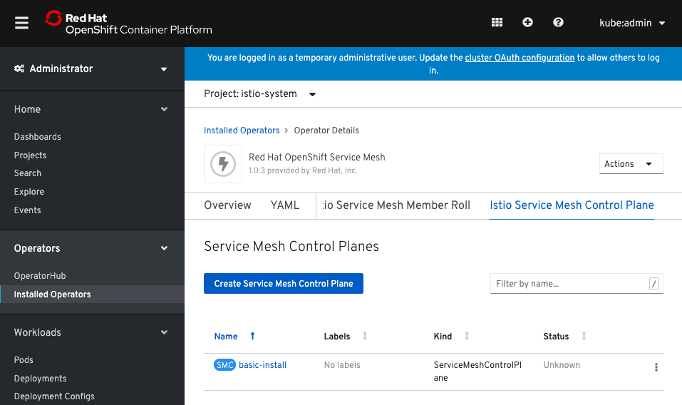
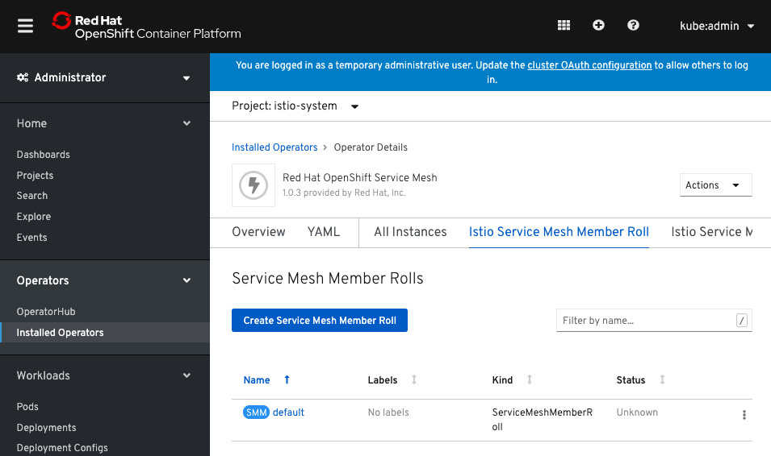

## Prerequisite
1. The Red Hat OpenShift Service Mesh Operator must be installed
2. An account with the cluster-admin role
3. Access to the OpenShift Container Platform Command-line Interface (CLI), commonly known as `oc`


## 部署 Service Mesh Control Plane (SMCP) 
### 新增專案名 `istio-system`
```bash
oc new-project istio-system
```

### 新增 `Service Mesh Control Plane` 物件
```bash
cat > istio-installation.yaml << EOF
---
apiVersion: maistra.io/v1
kind: ServiceMeshControlPlane
metadata:
  name: basic-install
  namespace: istio-system
spec:
  istio:
    gateways:
      istio-egressgateway:
        autoscaleEnabled: false
      istio-ingressgateway:
        autoscaleEnabled: false
    mixer:
      policy:
        autoscaleEnabled: false
      telemetry:
        autoscaleEnabled: false
    pilot:
      autoscaleEnabled: false
      traceSampling: 100
    kiali:
      enabled: true
    grafana:
      enabled: true
    tracing:
      enabled: true
      jaeger:
        template: all-in-one
EOF
```

- 執行
```bash
oc apply -n istio-system -f istio-installation.yaml
```

- 監視變更狀態
```bash
# oc get pods -n istio-system -w
watch -n2 oc get pods -n istio-system
```

### 驗證 `Service Mesh Control Plane` 已安裝完畢
```bash
oc get smcp -n istio-system
oc get deployment,pods -n istio-system
```

- Excepted Output
```bash
NAME            READY
basic-install   True
NAME                                           READY   UP-TO-DATE   AVAILABLE   AGE
deployment.extensions/grafana                  1/1     1            1           2m21s
deployment.extensions/istio-citadel            1/1     1            1           6m1s
deployment.extensions/istio-egressgateway      1/1     1            1           3m25s
deployment.extensions/istio-galley             1/1     1            1           5m6s
deployment.extensions/istio-ingressgateway     1/1     1            1           3m25s
deployment.extensions/istio-pilot              1/1     1            1           4m7s
deployment.extensions/istio-policy             1/1     1            1           4m44s
deployment.extensions/istio-sidecar-injector   1/1     1            1           2m50s
deployment.extensions/istio-telemetry          1/1     1            1           4m44s
deployment.extensions/jaeger                   1/1     1            1           5m9s
deployment.extensions/kiali                    1/1     1            1           100s
deployment.extensions/prometheus               1/1     1            1           5m43s

NAME                                         READY   STATUS    RESTARTS   AGE
pod/grafana-56f9c8b54-rw24s                  2/2     Running   0          2m21s
pod/istio-citadel-5d5c8687df-qrjlm           1/1     Running   0          6m1s
pod/istio-egressgateway-6686d54c49-4mlk7     1/1     Running   0          3m25s
pod/istio-galley-86d9d8d49b-cmnh2            1/1     Running   0          5m6s
pod/istio-ingressgateway-56857ff7f7-qgg2m    1/1     Running   0          3m25s
pod/istio-pilot-fb5f78c44-m8mfh              2/2     Running   0          4m7s
pod/istio-policy-56c77687b5-vkg2t            2/2     Running   0          4m44s
pod/istio-sidecar-injector-b6985f8b8-vt28f   1/1     Running   0          2m50s
pod/istio-telemetry-775f7df579-zxkhv         2/2     Running   0          4m44s
pod/jaeger-57776787bc-48pj2                  2/2     Running   0          5m9s
pod/kiali-967b567b6-lf8vd                    1/1     Running   0          100s
pod/prometheus-6488c47945-9tq66              2/2     Running   0          5m43s
```

- Expected Web view



### 新增 `Service Mesh Member Rolls`
```bash
cat > servicemeshmemberroll-default.yaml << EOF
---
apiVersion: maistra.io/v1
kind: ServiceMeshMemberRoll
metadata:
  name: default
  namespace: istio-system
spec:
  members:
    # a list of projects joined into the service mesh
    - default
EOF
```

> Note: 若有新增專案監控需求，請直接修改該 YAML。你可以新增任意數量的專案於此，但每一個專案僅能屬於 1 個 ServiceMeshMemberRoll 資源


- 執行
```bash
oc apply -n istio-system -f servicemeshmemberroll-default.yaml
```

- Expected Web view


- 修改
```
oc edit smmr -n istio-system
```

### 驗證 `Service Mesh Member Rolls` 已被新增
```bash
oc get smmr -n istio-system
```
- 修改spec區塊，並且加入bookinfo這個project
```
spec:
  members:
  - default
  - bookinfo
```
- Expected Output
```bash
NAME      MEMBERS
default   [default bookinfo]
```
