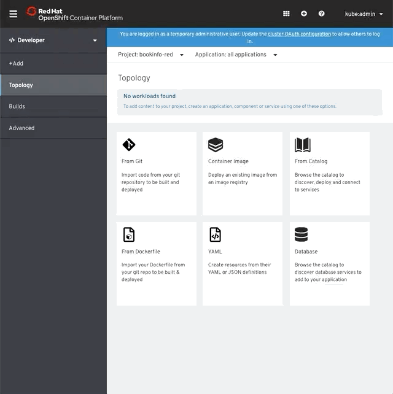
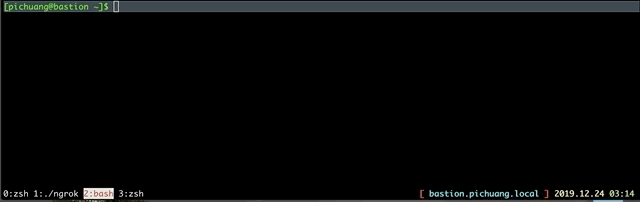

## Deploy A Bookinfo Store

### Prerequisite 
```bash
# Setup Project name
BOOKINFO_PROJECT=bookinfo-red && echo $BOOKINFO_PROJECT

# Get Istio Latest Release Version
ISTIO_RELEASE=$(curl --silent https://api.github.com/repos/istio/istio/releases/latest |grep -Po '"tag_name": "\K.*?(?=")') && echo $ISTIO_RELEASE
```

### Deploy Microservices App into specific project
```bash
# Create Project
oc new-project $BOOKINFO_PROJECT

# Add project into service mesh member
oc get smmr default -n istio-system -o json --export | jq '.spec.members += ["'"$BOOKINFO_PROJECT"'"]' | oc apply -n istio-system -f -

# Apply bookinfo
oc apply -n $BOOKINFO_PROJECT -f https://raw.githubusercontent.com/istio/istio/${ISTIO_RELEASE}/samples/bookinfo/platform/kube/bookinfo.yaml

# Patch sidecar annotation into template in deployment object
for deployment in $(oc get deployments -o jsonpath='{.items[*].metadata.name}' -n $BOOKINFO_PROJECT);do
    oc -n $BOOKINFO_PROJECT patch deployment $deployment -p '{"spec":{"template":{"metadata":{"annotations":{"sidecar.istio.io/inject": "true"}}}}}'
done

# Apply bookinfo gateway
oc apply -n $BOOKINFO_PROJECT -f https://raw.githubusercontent.com/istio/istio/${ISTIO_RELEASE}/samples/bookinfo/networking/bookinfo-gateway.yaml
```




### Get the Ingress Gateway
```bash
# Get Ingress GW URL
GATEWAY_URL=$(oc -n istio-system get route istio-ingressgateway -o jsonpath='{.spec.host}') && echo $GATEWAY_URL

# Confirm the app is accessible from outside the cluster
while true; do sleep 1; curl -s http://${GATEWAY_URL}/productpage | grep -o "<title>.*</title>";done
```




## Clean Up
```bash
oc delete -n $BOOKINFO_PROJECT -f https://raw.githubusercontent.com/istio/istio/${ISTIO_RELEASE}/samples/bookinfo/networking/bookinfo-gateway.yaml
oc delete -n $BOOKINFO_PROJECT -f https://raw.githubusercontent.com/istio/istio/${ISTIO_RELEASE}/samples/bookinfo/platform/kube/bookinfo.yaml
oc delete project $BOOKINFO_PROJECT
```