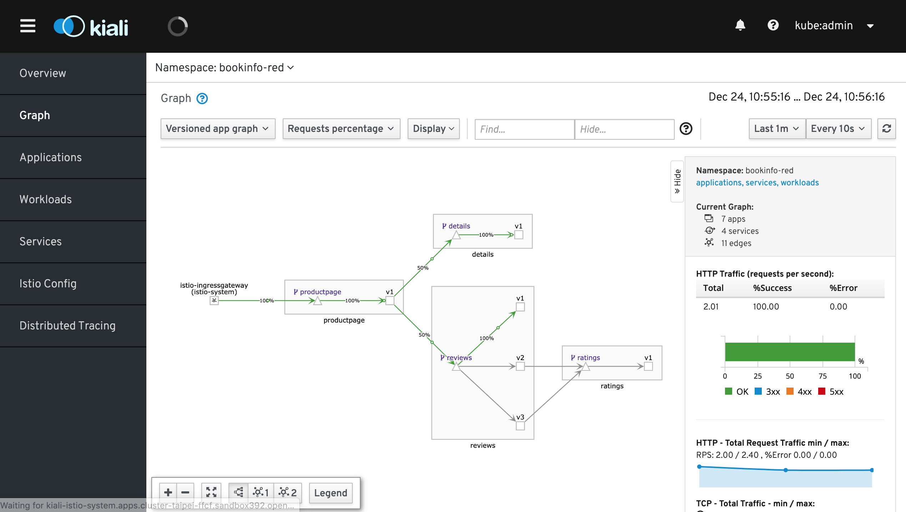
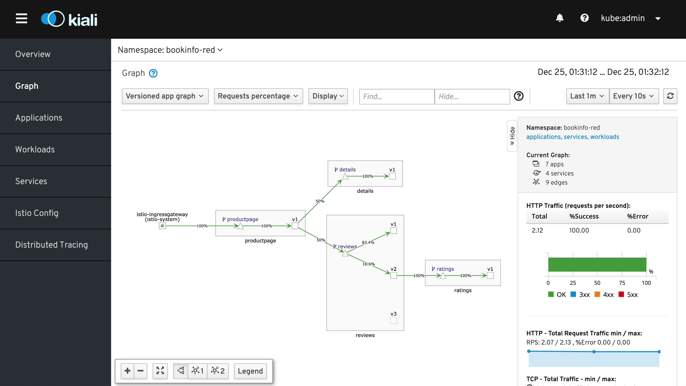
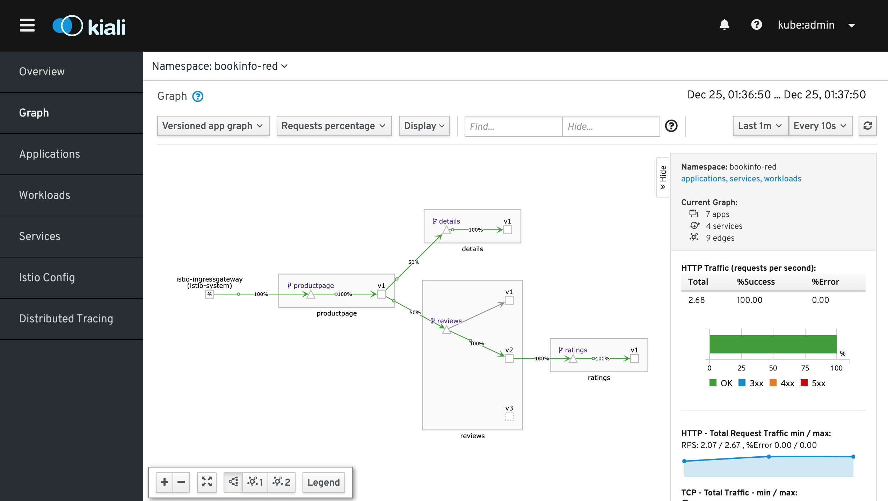

## Prerequisite

將所有流量都導流到各服務 (service) 的 v1 版本，其服務包含 productpage、details、reviews、ratings

```bash
oc apply -n $BOOKINFO_PROJECT -f destination-rule-all.yaml
oc apply -n $BOOKINFO_PROJECT -f virtual-service-all-v1.yaml
```




## 基於流量比例的路由

Istio 能夠基於百分比的流量控制，精確地將不同比例的流量分發給指定的版本，適用於 A/B 測試場景

### Lab 1: 80:20 導流

開發人員需要於 reviews 欄位新增具有 ratings 的功能，故需要升級 reviews 服務至 v2 版本。故開發人員先將 reviews v2 服務部署於平台上後，透過控制流量比例為 reviews v1:v2 = 80:20 進行流量切換測試

```bash
cat virtual-service-reviews-80-20.yaml
oc apply -n $BOOKINFO_PROJECT -f virtual-service-reviews-80-20.yaml
```



### Lab 2: 全流量切換 v2 

開發人員經由 Lab 1 測試後認為 reviews v2 版本可以正常運作於線上環境中，故將 reviews 的流量完全切換至 v2 的版本

```bash
cat virtual-service-reviews-v2.yaml
oc apply -n $BOOKINFO_PROJECT -f virtual-service-reviews-v2.yaml
```




## 基於請求內容的路由

Istio 可以基於不同的請求內容將流量導到不同的版本，這種情境也常見於 A/B 測試場景

### Lab 3: 針對 Chrome 瀏覽器進行


## Clean Up
```bash
oc delete -n $BOOKINFO_PROJECT -f destination-rule-all.yaml
oc delete -n $BOOKINFO_PROJECT -f virtual-service-all-v1.yaml
```
