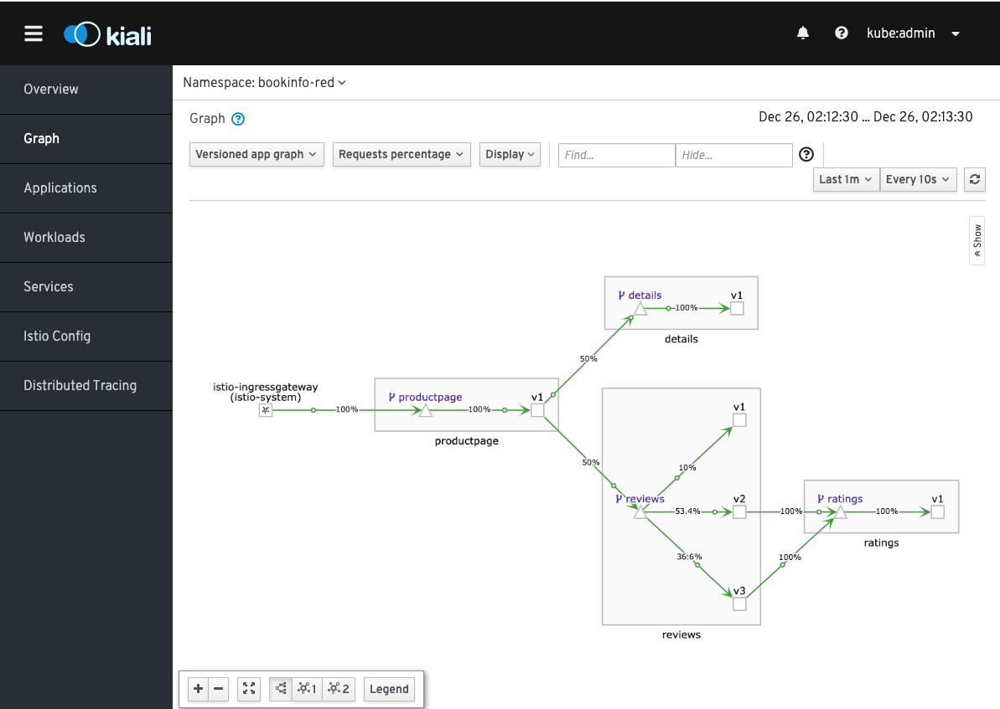
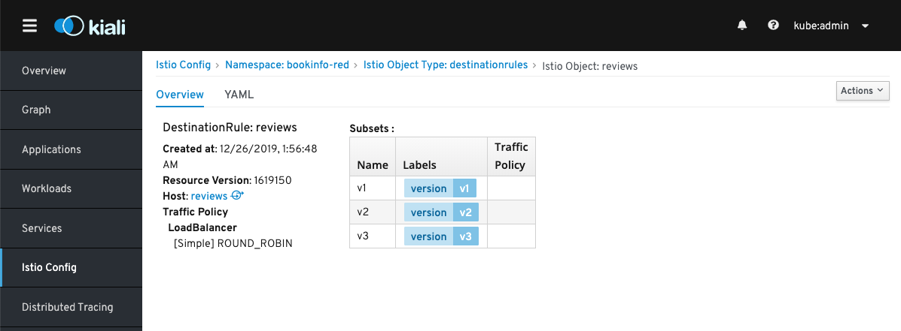

## Prerequisite

將所有流量都導流到任意版本

```bash
oc apply -n $BOOKINFO_PROJECT -f destination-rule-all.yaml
oc apply -n $BOOKINFO_PROJECT -f virtual-service-reviews-all.yaml
```



## 流量負載均衡能力

### Round-Robin 模式

```bash
cat destination-rule-reviews-round-robin.yaml
oc apply -n $BOOKINFO_PROJECT -f destination-rule-reviews-round-robin.yaml
```



### Random 模式

```bash
cat destination-rule-reviews-random.yaml
oc apply -n $BOOKINFO_PROJECT -f destination-rule-reviews-random.yaml
```


## 會話保持


## Clean Up
```bash
oc delete -n $BOOKINFO_PROJECT -f destination-rule-all.yaml
oc delete -n $BOOKINFO_PROJECT -f virtual-service-reviews-all.yaml
```